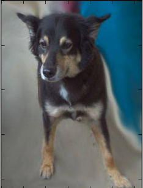
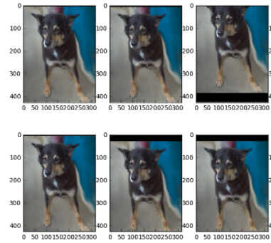
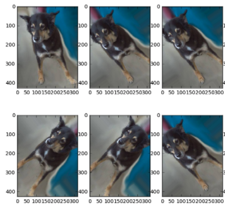

The techniques that are listed here was learned from Jeremy Howards deep learning class, which is now a MOOC.
You can locate it on his wesite [fast.ai](http://course.fast.ai/){:target="_blank"}. 

Like other machine learning techniques, Deep Learning is prone to overfitting. 
Overfitting is the idea that the model is learning the specifics of your training data
in such a way that it doesn't generalize as well when applied to new data.
Below are steps to reduce overfitting. 

1. [Obtain More Data.](#more-data)
2. [Data Augmentation](#data-augmentation)
3. [Generalized architecture](#generalized-architecture)
4. [Add regularization](#regularization)
5. [Reduce architecture complexity](#reduce-architecture-complexity)

#### More Data

It might be obvious, but the most significant way to improve the model is to 
obtain more data which would provide more known values for training. But it is 
not always possible to obtain more data. For example, if you are using data
provided by your company, then you might already be using the max amount of data; 
Or it might be costly to collect data; Or in the case of competitions like kaggle,
there is only a limited set of data available. 

#### Data Augmentation

There is never perfect correlation between all the values for a given data. 
Using this knowledge, we can synthetically create additional data by shifting values 
in the dataset in a way that the knew values are still reasonable. For example, in 
a dataset where all the values are continuous values, we might be able to create 
new data by shifting values from a range of + or - 1 standard deviation. In the case 
of images, we might want to rotate the image, shift it right or left, or perhaps 
modify the color a bit. Keras makes this process pretty simple. Below is a list of 
augmentation keras provides: [[source]](https://keras.io/preprocessing/image/){:target="_blank"}

---
    keras.preprocessing.image.ImageDataGenerator(featurewise_center=False,
        samplewise_center=False,
        featurewise_std_normalization=False,
        samplewise_std_normalization=False,
        zca_whitening=False,
        rotation_range=0.,
        width_shift_range=0.,
        height_shift_range=0.,
        shear_range=0.,
        zoom_range=0.,
        channel_shift_range=0.,
        fill_mode='nearest',
        cval=0.,
        horizontal_flip=False,
        vertical_flip=False,
        rescale=None,
        preprocessing_function=None,
        data_format=K.image_data_format())

Let's take a look at a couple of usage and general advice on what to look for. 

We will be performing operation on an image of a dog:

To augment the image so as to distort the height, we would use adjust the 
height_shift_range parameter. 

---
    image.ImageDataGenerator(height_shift_range = .1,
                             fill_mode = 'constant',
                             dim_ordering = 'tf')

From above, you can see that the each image is randomly shifted up or down 
padded by a black border. The parameter of .1 tells the generator to only shift
by a value of + or - .1 of the ratio of the image. Shifting the image to 
generate new data makes sense since the area of interest is the dog, thus 
by shifting, we remove focus of the surroundings on some of the generated batches
when training a model. If the shift_range is too big, the image of interest may 
disappear from the picture. Thus, a reasonable size will need to be chosen, perhaps 
through a grid search method. 

Instead of shifting the image, we can do other augmentation as well. 
I'll only be showing one other example, but feel free to try some yourself. 

---
    image.ImageDataGenerator(rotation_range = 60,
                             fill_mode = 'constant',
                             dim_ordering = 'tf')

In the above image, we are rotating the image in a range of + or - 60 degrees. 
This augmentation parameter makes sense since a camera can be held a varying angles. 

Once you have collected all of the parameters of interests, you can combine
them into one generate to generate a range of synthetic images. 

#### Generalized Architecture

Parameter tuning - Adding and removing layers, adjusting the size of neurons, etc. 
will be required to generalize your model. In addition to parameter tuning, instead of 
starting from a model that worked really well for a particular use case, you might want 
to find an architecture that generalizes well for several use cases. 

#### Regularization

The main use of regularization in deep learning are dropouts. This will randomly set 
x% of your layer input's weights to 0, thus allowing for some specific features being 
drdog_rot_shift
dog_height_shift
dog_originalopped, and the model being more generalized. Use dropout with care, since this 
method definitely removes some learned information. 

In addition to dropout, common machine learning regularization techniques such as 
L2 Norm and L1 Norm can be utilized. 

#### Reduce Architecture Complexity

Really complex models can do well during the training set due to learning the
specifics really well. But if layers were removed, then the model may become more 
generalized. 

#### Conclusion

Using the techniques described above, I was able to rank in the top 20% of the the second
[Dogs Versus Cats Tutorial on Kaggle](https://www.kaggle.com/c/dogs-vs-cats-redux-kernels-edition){:target="_blank"}. 

In addition to overfitting, we might have a problem of underfitting which means 
that we have not learn the generalized form enough. To combat this, we can reverse 
the solution as described above. 