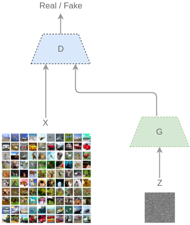
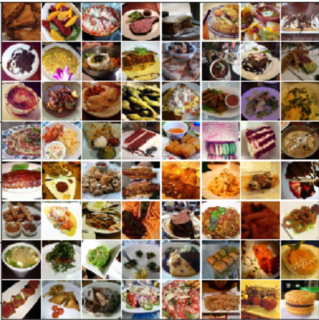
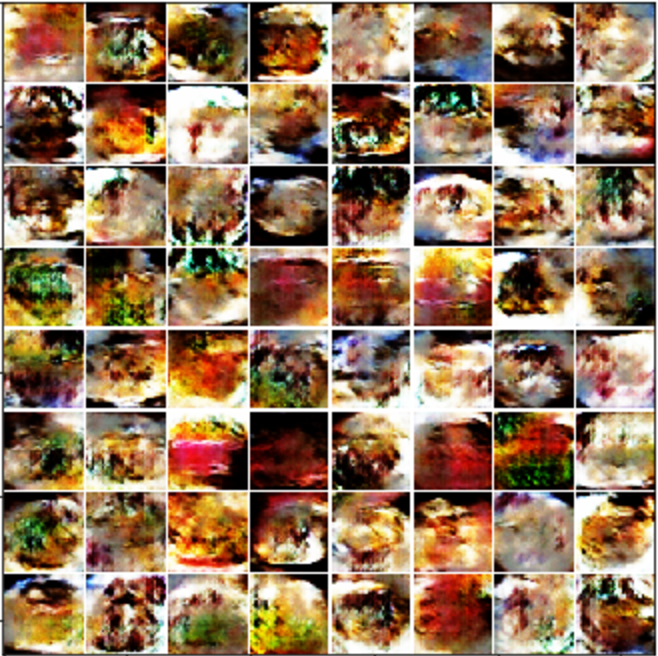
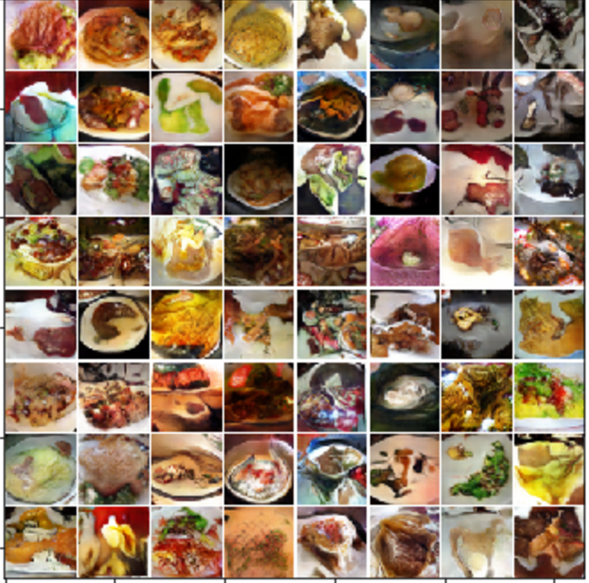

#### Intro

Generative Adversarial Networks (GANs) is a technique for generating new samples that looks similar to the original data. 
It can be useful for cases where you need to increase the size of your dataset with the only inputs required are random white noise. 

GANs is unique in that it utilizes two neural networks, one called the Discrimator where it always try to detect whether a sample is from 
the originating dataset, and the othe neural network is the Generator where it attempts to generate data that will fool the Discrimator 
into thinking it came from the originating dataset. Thus the Discrimator and the Generator plays an eternal game of cat and mouse where
the optimal solution is an equilibrium between the two - Where the Discrimator can only detect fake data 50% of the time and the Generator can only fool the Discrimator only 50% of the time. 

[source: https://tryolabs.com/blog/2016/12/06/major-advancements-deep-learning-2016/](https://tryolabs.com/blog/2016/12/06/major-advancements-deep-learning-2016/){:target="_blank"}

#### Problems with GANs

One common problem with GANs is the concept of mode collapse. Mode collapse is the idea that the Generator gets stuck in a local
minima and continues to create the same image over and over again with no room for improvement. 

Another common problem is to determine how many iteration of training should you run for both the Generator and Discriminator. 
The general rule of thumb is to run one iteration of Generator than multiple iteration of Discrimator, and repeat. 

Both problems described above is remedied in the Wasserstein version of GANs (WGAN). Mode collapse is limited due to a contraint placed 
on the weights to be no greater than an absolute value (normally .01). In addition, in WGAN, the Discrimator is trained to optimallity. 

But the question remains, is it possible to generalize GANs so that it works with any dataset? Or will an archicture have to be carefully crafted for each problem?

#### Playing with GANs

I attempted to use GANs to create my own cookbook - a cookbook of synthetic food. For my datasource of food, I used the [Food-101 dataset](https://www.vision.ee.ethz.ch/datasets_extra/food-101/){:target="_blank"} which contains images of 101 different kinds of food. __Random selections of the sample looks like:__

{:width="500px"}

I ran the Wasserstein GANs version on a P2 instance on AWS which utilizes Tesla K80 GPUs. 

__after 10 iteration:__ 

{:width="500px"}

After 10 iteration, it seems that GANs was able to produce a cookbook of food that has been turned to mush. Training 
10 epochs took about 1 hour, so I decided to let it run for a little longer. 

__after 200 iteration:__

{:width="500px"}

After 200 iteration, it has not produced the most convincing food, but it starts to look a lot more real. For example, the top left image seems to be some sort of roasted chicken, and in the second to last row and column, it seems to be eggs and peas. This took about 20 hours to produce, thus I stopped the improvements here due to the cost of AWS P2 instance.

The next step in creating my cookbook is to train some sort of classifier so that I can use it to predict what the ingredients are in each image. That will be left for a future project, so stay tuned.   

#### references: 

- Generative Adversarial Nets :[https://arxiv.org/pdf/1406.2661v1.pdf](https://arxiv.org/pdf/1406.2661v1.pdf){:target="_blank"}

- Wasserstein GAN : [https://arxiv.org/pdf/1701.07875.pdf](https://arxiv.org/pdf/1701.07875.pdf){:target="_blank"}

- Unsupervised Representation Learning with Deep Convolutional Generative Adversarial Networks : [https://arxiv.org/pdf/1511.06434v2.pdf](https://arxiv.org/pdf/1511.06434v2.pdf){:target="_blank"}