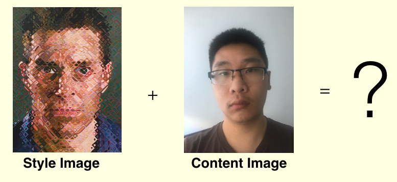
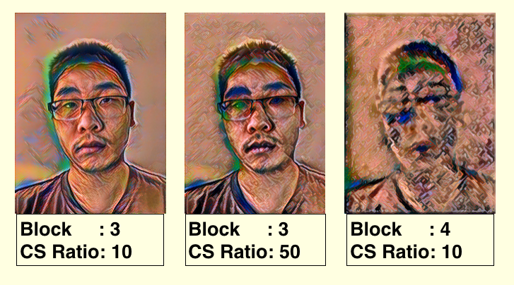

Neural Style transfer is the idea of transforming an image into the style of another image, visually similar to how you can change filters on cameras.
The idea was popularized by Google's [Deep Dream](https://research.googleblog.com/2015/06/inceptionism-going-deeper-into-neural.html){:target="_blank"} post. 

Below, I ran neural style transfer over an image of myself as the content and an image by [Chuck Close](https://en.wikipedia.org/wiki/Chuck_Close)'s James which was last seen at SF MOMA as the style. For the content layer, I have a tunable parameter that takes a block as the final layer from a VGG16 model. For the style layer, I obtain the first convolutational layer for the first 6 blocks of a VGG16 model. In addition to that, there another tunable parameter is the content to style ratio, which takes into account which loss is more important to measure when training the neural net. 

By adjusting the content to style ratio and layers, we get different results after 10 iteration:

As you can see, with more Content-Style (CS) Ratio, the image tends to look more in the style of Chuck Close's picture. Also, choosing a block is important, since if it is too high, the original content might disappear in favor of some other aspect of the picture. Another improvement that can be done is to preserve the color of the content image, which to do so, I would recommend reading the paper referenced below. 

#### references: 

- A Neural Algorithm of Artistic Style :[https://arxiv.org/pdf/1508.06576.pdf](https://arxiv.org/pdf/1508.06576.pdf){:target="_blank"}

- Improving the Neural Algorithm of Artistic Style : [https://arxiv.org/pdf/1605.04603.pdf](https://arxiv.org/pdf/1605.04603.pdf){:target="_blank"}

- Preserving Color in Neural Artistic Style Transfer : [https://arxiv.org/pdf/1606.05897.pdf](https://arxiv.org/pdf/1606.05897.pdf){:target="_blank"}
